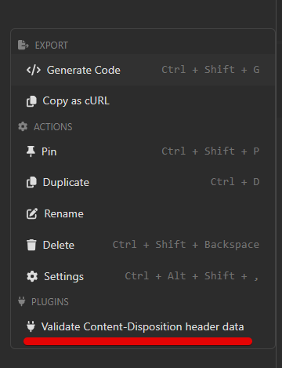
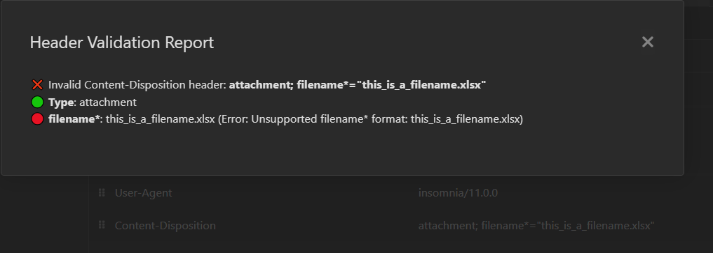
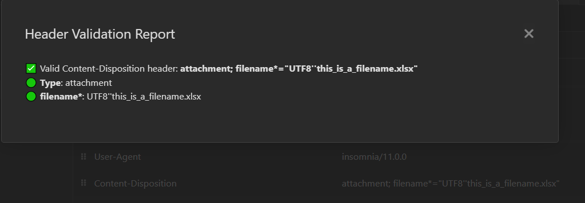

# Insomnia Plugin: Content-Disposition Validator

A plugin for [Insomnia](https://insomnia.rest/) to validate `Content-Disposition` headers based on [RFC-6266](https://datatracker.ietf.org/doc/html/rfc6266).

## Features

- Validates the `Content-Disposition` header in HTTP requests.
- Displays detailed validation results, including parameter values and errors.
- Supports enabling/disabling validation via plugin settings.

## Usage

1. Open a request in Insomnia.  
2. Right-click on the request and select **"Validate Content-Disposition header data"**.  
   
3. View the validation results in a dialog.  
   
   

## Settings

You can enable or disable the plugin via the **Header Validator Settings** in the Insomnia plugin configuration.
